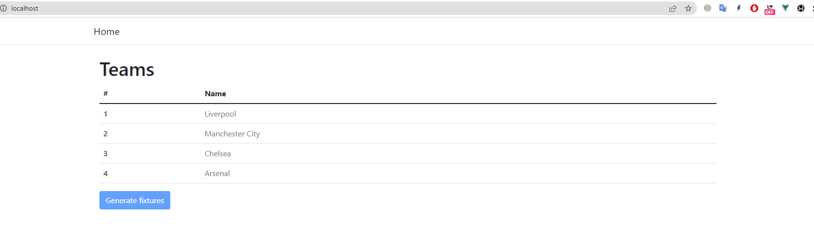
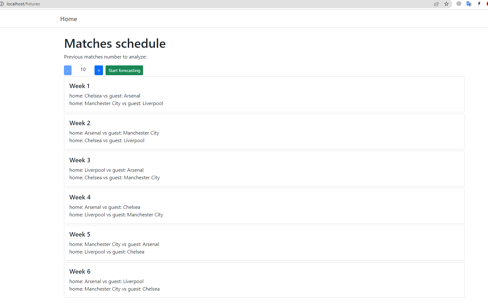

## Test task

Create an application that predicts the result of the victory of football teams in the tournament.

## Implementation

Algorithm that I've used:

To calculate the probability of a home team winning, find the sum of its wins in the last 10 home games and its
opponent's losses in the last 10 away games. Next, divide the resulting number by 20 (the total number of games)
and multiply by 100. Thus, you have found the percentage probability of the home team winning.

To find out the probability of a draw, add up the draws of the teams in the last 10 games and divide the total
by 20, and then also multiply the resulting number by 100.

According to the same principle, the probability of the guest team winning is determined.
It is necessary to add up the team's away wins in the last 10 away games and add to them the opponent's home
defeats in the last 10 home matches. Next, the resulting number must be divided by 20 and multiplied by 100.

Let's make a calculation using the example of the RFPL game between Kazan Rubin and Zenit St. Petersburg.

Rubin's statistics in home games: 4 wins, 2 draws and 4 losses.
Zenit statistics in away games: 6 wins, 4 draws and 0 losses.
We determine the probability of passing outcomes:

Rubin's victory: 4 (Rubin's victories) + 0 (Zenit's defeats)=4, 4/20*100=20% ( probability of Ruby's victory)
Draw: 2(Rubin draws) + 4(Zenit draws)=6, 6/20*100=30% ( probability of a draw)
Zenit Victory: 6 (Zenit wins)+4 (Rubin defeats)=10, 10/20*100=50% ( the probability of Zenit's victory)

Source: https://bukmekerskie-kontory.bet/betting/wiki/probs/

Then I multiplied every probability, week by week because the events are bound. 

## How use this solution

1) You should have `docker` and `docker-compose` installed. 
2) Clone repo
3) Be sure in you have port 80 free
4) In your terminal type `docker-compose up -d`
5) Type `docker-compose exec php-fpm bash`
6) Being inside the container run the following in you terminal `composer install && npm install && npm run dev && php artisan migrate --seed`
7) Run tests `php artisan test`
8) Go to `http://localhost/` in your browser

## Screenshots 

## Note 

All the data is generated with the help of seeding and the statistic is random and only for demonstration purposes.

!!! `.env` is in the repo for demonstration purposes only. Do not do it in real world application.
